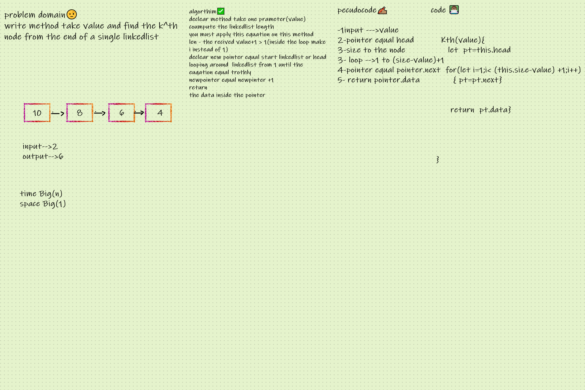

# Linked list Kth

[test](kth.test.js)

[code](kth.js)

# Problem Domain
problem domain🤨
write method take value and find the k^th node from the end of a single linkedlist
## Whiteboard Process

 ## Approach & Efficiency

Returns values according to a given encoding from the last of the array

  time Big O(n)
  space Big O(1)

