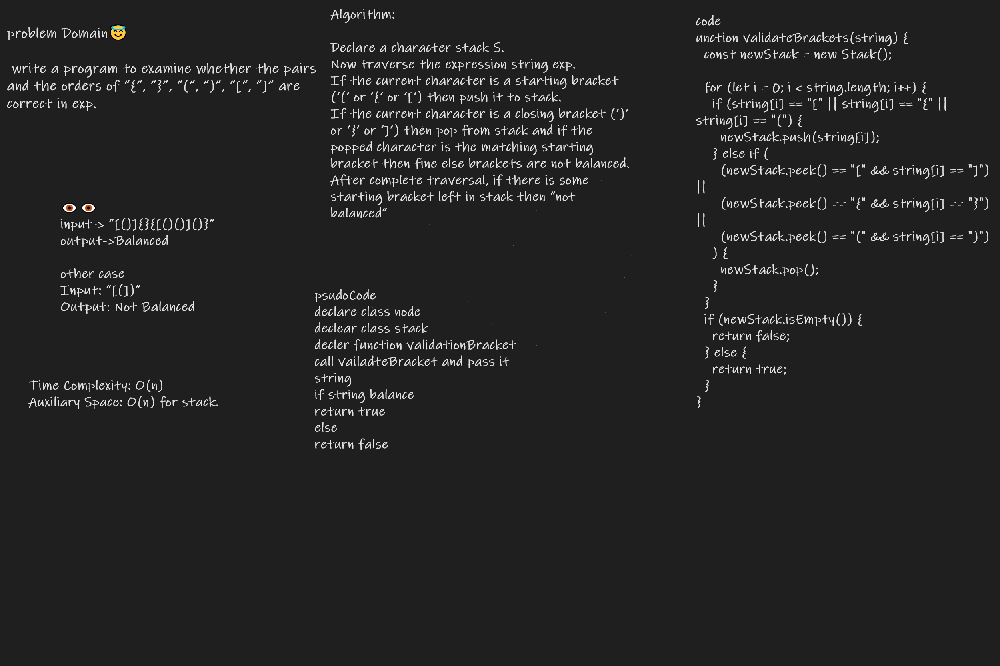

Write a function called validate brackets

Arguments: string Return: boolean representing whether or not the brackets in the string are balanced There are 3 types of brackets:

Round Brackets : ()
Square Brackets : []
Curly Brackets : {}
Given an expression string exp, write a program to examine whether the pairs and the orders of “{“, “}”, “(“, “)”, “[“, “]” are correct in exp

Input: exp = “[()]{}{[()()]()}” 
Output: true

Input: exp = “[(])” 
Output: false

Whiteboard Process

Approach & Efficiency
Declare a character stack S.
Now traverse the expression string exp.
If the current character is a starting bracket (‘(‘ or ‘{‘ or ‘[‘) then push it to stack.
If the current character is a closing bracket (‘)’ or ‘}’ or ‘]’) then pop from stack and if the popped character is the matching starting bracket then fine else brackets are not balanced.
After complete traversal, if there is some starting bracket left in stack then “not balanced”
Time Complexity:

Push operation : O(1).

Pop operation : O(N).

Auxiliary Space: O(N).

| Syntax      | Description |
| ----------- | ----------- |
| Queue|[stack](./Stack.js)|
| bracket|[brackt](./bracket.js)|
| bracktTest|[bracktTest](./__test__/bracket.test.js)|

