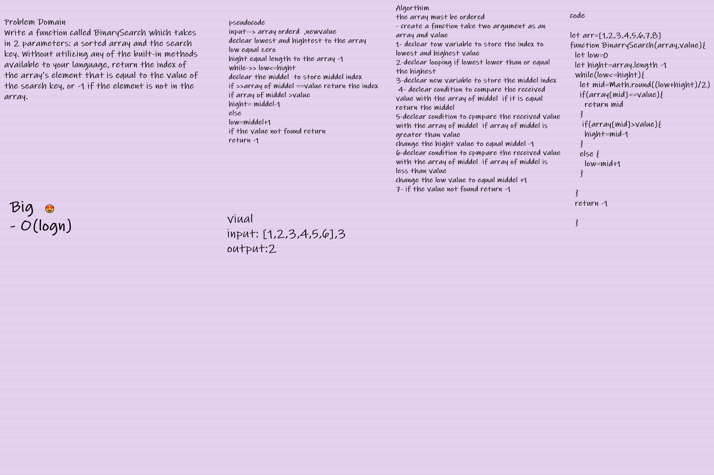

# Binary Search 

[test](Binarry.test.js)

[code](binarySearch.js)

# Array binary Search

Problem Domain
Write a function called BinarySearch which takes in 2 parameters: a sorted array and the search key. Without utilizing any of the built-in methods available to your language, return the index of the array’s element that is equal to the value of the search key, or -1 if the element is not in the array.
## Whiteboard Process

 ## Approach & Efficiency

this algorithm make search inside the array more easy and faster than original array because not need to iterate over every element inside the array but the array must be order

 Big O(log n)

 