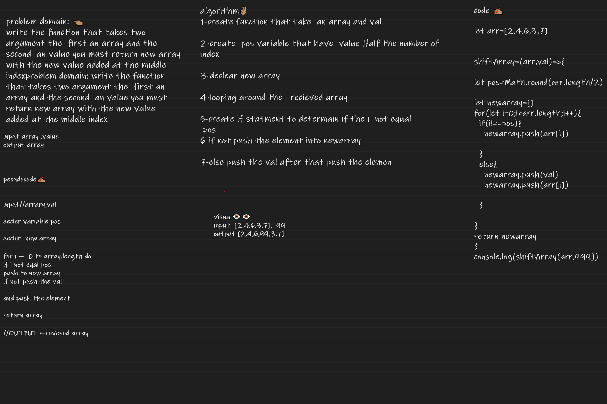

Shift Array

[testFile](./test.js.js)

# Shift Array

problem domain: 👈🏽
write the function that takes two argument the  first an array and the second  an value you must return new array with the new value added at the middle indexproblem domain: write the function that takes two argument the  first an array and the second  an value you must return new array with the new value added at the middle index
## Whiteboard Process

