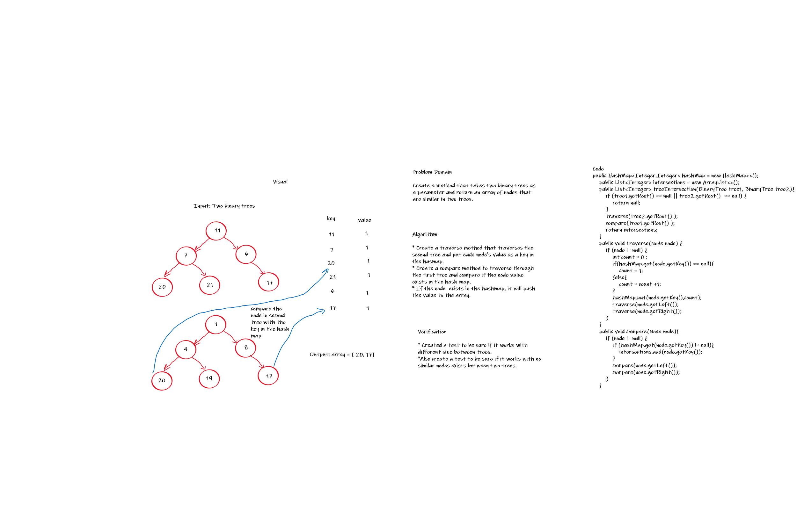

hashmap-tree-intersection

[hashmap-tree-intersection](hashmap-tree-intersection.js)


```
Problem Domain 

Create a method that takes two binary trees as a parameter and return an array of nodes that are similar in two trees

```

```
Alogrthims

Creato a traverse mothod that traverses the second tree and put cach node's value as a koy in the hasmap. * Creato a comparo mothod to traverse through the first tree and compare if the node valuc exists in the hash map. If the node cxists in the hashmap, it will push the value to the array.

```


```

//method treeIntersection
    treeIntersection(tree1, tree2) {
        // if tree empty 
      if (!tree1 || !tree2) return"root dose not exist🆑"

      let array = [];
      // traverse over the trees
      const Traverse = (value1, value2) => {
        if (value1 && value2) {
          if (value1.value === value2.value) {
              //push the value to the array
            array.push(value1.value);
            console.log(array);
          }
          // if the node had left or right use recursive
          if (value1.left, value2.left) Traverse(value1.left, value2.left);
          if (value1.right, value2.right) Traverse(value1.right, value2.right);
        }
        return array;
      }
      
      Traverse(tree1, tree2);
      return array;
    }

```



