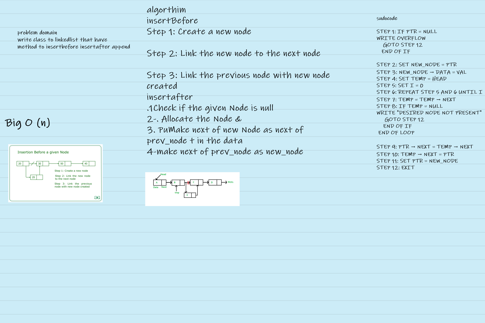

# insertion method to linked list  Search 

[test](linked.test.js)

[code](insertion.js)

# insertion to linked list

write class to linkedlist that have 
method to insertbefore insertafter append

## Whiteboard Process
 

 ## Approach & Efficiency

this algorithm to add value after specific value or before that take the same time with origanal array becuase i need while loop to determine the value

 Big O(n)

