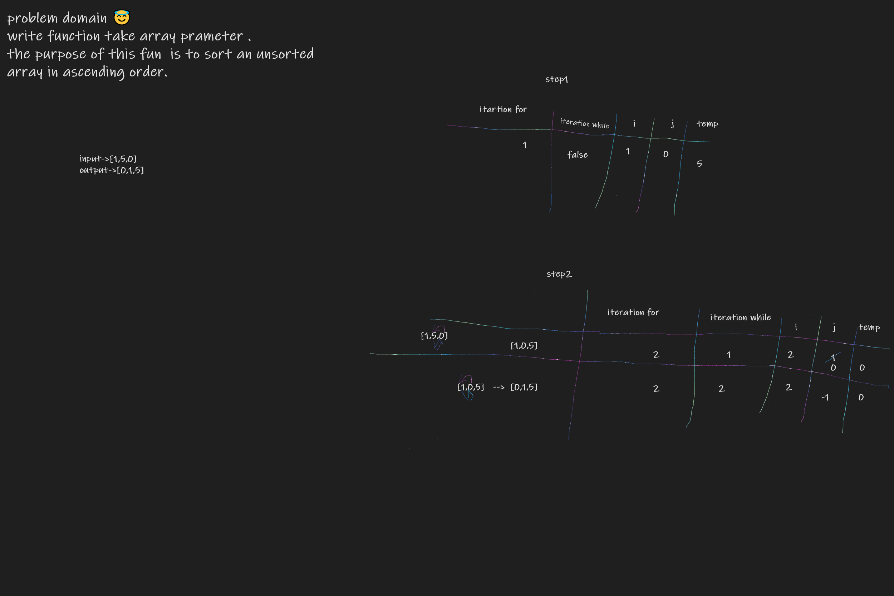

# Insertion Sort

This challenge relates to creating a method called insartionSort (int [] arr) that takes an int array as a parameter. The purpose of this method is to sort an unsorted array in ascending order.

# Pesudocode

```
InsertionSort(int[] arr)

    FOR i = 1 to arr.length

      int j <-- i - 1
      int temp <-- arr[i]

      WHILE j >= 0 AND temp < arr[j]
        arr[j + 1] <-- arr[j]
        j <-- j - 1

      arr[j + 1] <-- temp
```

# The Code

```

function  insertion(arr){
  for(let i=0;i<arr.length;i++){
    let j=i-1
    let temp= arr[i]
     while(j>=0 &&temp<arr[j]){
       arr[j+1]=arr[j]
       j=j-1
     }
     arr[j+1]=temp
    
  }
  return arr
 
}
console.log(insertion([1,40,3,4,0]))

```


# Trace


