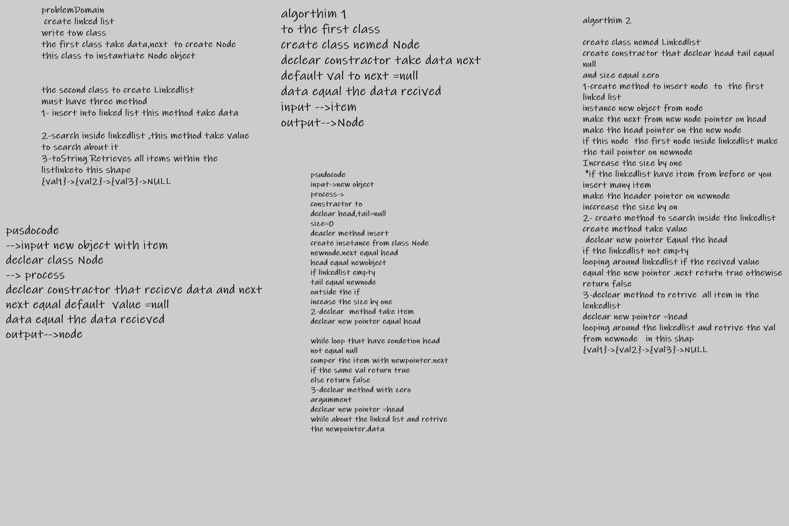

# Singly Linked List
A linked list is a linear data structure, in which the elements are not stored at contiguous memory locations. The elements in a linked list are linked using pointers as shown in the below image:

## Challenge

when insert in a spacific place in side linkedlist

## Approach & Efficiency

insert to the first using linkedlist take time O(1)

seacrh inside linked list take time O(n)

retrive take time O(n)

Methods in LinkedList Class

insertmethod take one paramter to insert the node in the first linkedlist

includes take one paramter  to find that inside linkedlist

tostring with no paramter to rerutn all item in linked list

[linkedList](Linkedlist.js)

[linkedlistTest](linkedlist.test.js)

[Node](Node.js)

[node.Test](Node.test.js)

