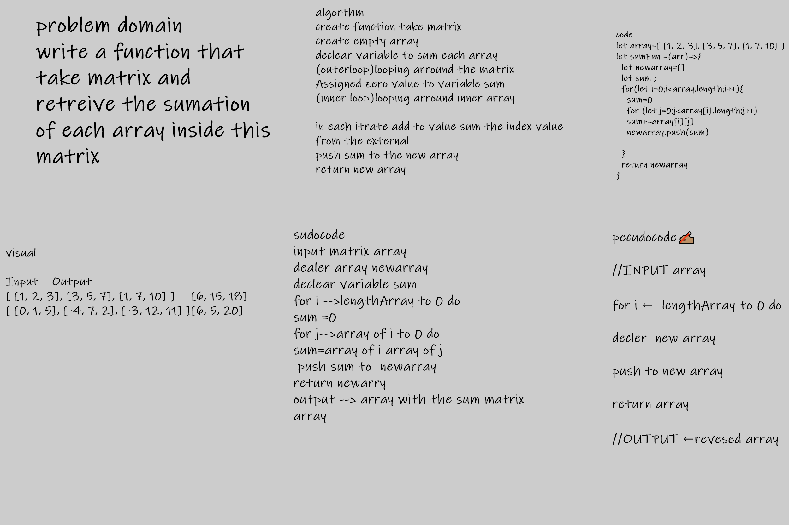

# matrix 

[testFile](./test.js)

# sum matrix  an Array

problem domain

write a function that take matrix and retreive the sumation of each array inside this matrix  
## Whiteboard Process

## Approach & Efficiency

time=O(n^2)

