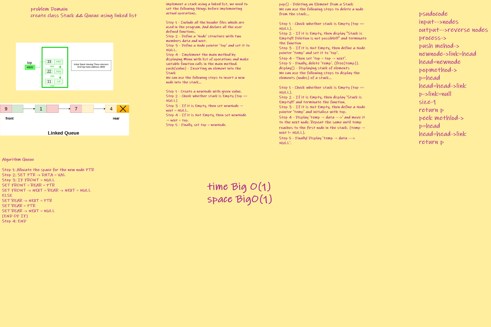

Stacks and Queues

A Stack is a data structure that consists of Nodes. Each Node references the next Node in the stack, but does not reference its previous.
Unlike stacks, a queue is open at both its ends. One end is always used to insert data (enqueue) and the other is used to remove data (dequeue).
Challenge
To implement stack and queue using linked list .
Approach & Efficiency
Used the Node class which holds the data and a reference variable of type node to implement Stacks and queues with Time complexity of O(1) for methods and O(n) in the toString method .
---

API
Stack (FILO/LIFO):
Methods:
push(T data) : Adds a new element to the stac with void return value .
pop() : removes the top element of the stack with Node return type .
peek() : Returns the top element of the stack with Node return value .
isEmpty() : Returns boolean if the stack was empty or not regarding it's idx .
toString() Overriden : Displays the data held in the stack with String return value .
---

Queue (FIFO/LILO):
Mthods:
enqueue (G data): Adds an element to the rear of the queue with void return type .
dequeue (): Removes element from the front of the queue with Node return type .
peek (): Returns the front item which is the oldest item entered Node return type .
isEmpty (): Returns boolean if the queue was empty or not .
toString() Overriden : Displays the data held in the queue with String return value .

| Syntax      | Description |
| ----------- | ----------- |
| Queue|[Queue](Queue.js)|
| QueueTest|[QueueTest](Queue.test.js)|
| Stack|[Stack](stack.js)|
| StackTest|[StackTest](stack.test.js)|

whiteBoard

